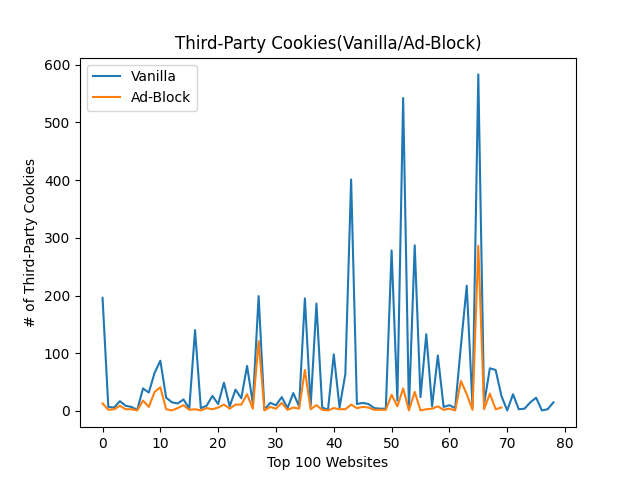
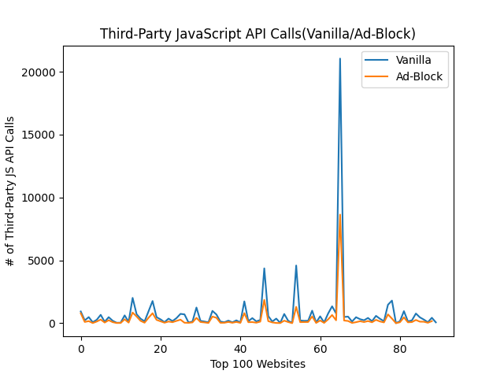

# OpenWPM Analysis 
## Intro
In this project, I conducted different types of browser measurements based on the data collected from 
crawling the top 100 websites. The goal is to analyze the difference in the amount of third-party HTTP requests, 
third-party cookies, and JavaScript API calls when browsing in “ad-block mode” compared to browsing in “vanilla mode” (ad-blocking disabled). 

The top 100 websites are collected from Tranco (https://tranco-list.eu/download_daily/56JN). The open source crawler tool, OpenWPM (https://github.com/citp/OpenWPM), 
is from Mozilla and it records the HTTP requests, cookies, and JavaScript API calls. 

## HTTP Requests

From the plot shown above, we can see that there is a greater amount of third-party requests when browsing in vanilla mode as opposed to ad-block mode. 
On average, the websites in vanilla mode have about 300 HTTP requests, while websites in ad-block mode have an average of about 150 HTTP requests. That is a reduction of about roughly 50% in HTTP requests,
which shows the impact that ad-blocking extensions have on our browsers.

## Top 10 Third-Party Domains (HTTP Requests)
|Domain (Vanilla) | # of HTTP Requests (Vanilla)|   | Domain (Ad-Block) | # of HTTP Requests (Ad-Block) |
| ----------------| ----------------------------|---|-------------------|-------------------------------|
|ssl-images-amazon.com |891                     |   |ssl-images-amazon.com|429                          |
|csdnimg.cn            |512                     |   |csdnimg.cn           |254                          |
|msocdn.com            |498                     |   |msocdn.com           |249                          |
|alicdn.com            |458                     |   | cloudfront.net      |202                          |
|cloudfront.net        |405                     |   | alicdn.com          |198                          |
|pinimg.com            |398                     |   | pinimg.com          |198                          |
|sohu.com              |388                     |   | awsstatic.com       |164                          |
|pstatic.net           |367                     |   |  sinaimg.cn         |152                          |
|awsstatic.com         |329                     |   | qhimg.com           |150                          |
|doubleclick.net       |306                     |   | pstatic.net         |133                          |

## Cookies

In the plot shown above, a majority of the third-party cookies have almost been reduced to zero when browsing in ad-block mode. In vanilla mode, the average number of cookies is around 100, whereas ad-block mode reduced the average to about 30. This shows that ad-blocking extensions are very efficient in reducing the amount of cookies. 

## Top 10 Third-Party Domains (Cookies)
|Domain (Vanilla) | # of Cookies (Vanilla)|   | Domain (Ad-Block) | # of Cookies (Ad-Block) |
| ----------------| ----------------------|---|-------------------|-------------------------------|
|cloudflare.com |543                      |   |cloudflare.com     |269                            |
|yahoo.com      |291                      |   |amazon.com         |123                            |
|demdex.net     |258                      |   |microsoft.com      |35                             |
|pubmatic.com   |195                      |   |live.com           |32                             |
|amazon.com     |190                      |   |weebly.com         |30                             |
|doubleclick.net|171                      |   |bbc.com            |28                             |
|adsrvr.org     |170                      |   |doubleclick.net    |25                             |
|rubiconproject.com|154                   |   |linkedin.com       |24                             |
|bbc.com        |129                      |   |yahoo.com          |24                             |
|microsoft.com  |114                      |   |google.com         |22                             |

Ad-serving domains like demdex.net, pubmatic.com, doubleclick.net, and rubiconproject.com are very common in vanilla mode. When ad-blocking mode is enabled, most of these ad-based third-party domains no longer appear in our list. Most of the domains in ad-block mode consist of domain names we usually see like amazon.com and microsoft.com. 

## JavaScript API Calls

The amount of JavaScript API calls are slightly reduced when ad-blocking mode is enabled but there isn’t a drastic difference compared to the two plots we have seen above. We can see that the vanilla and ad-block lines are quite close to each other which may infer that JavaScript calls can be essential to the functionality of a website. Thus, enabling ad-blocking mode will not make a huge difference. 

## Top 10 Third-Party Domains (JavaScript API Calls)
|Domain (Vanilla) | # of JS API Calls (Vanilla)|   | Domain (Ad-Block) | # of JS API Calls (Ad-Block) |
| ----------------| ----------------------|---|-------------------|---------------------------------- |
|forbesimg.com    |13739                  |   |forbesimg.com      |6691                               |
|media.net        |6368                   |   |media.net          |2099                               |
|google-analytics.com |2487               |   |youtube.com        |1347                               |
|alicdn.com       |2162                   |   |alicdn.com         |955                                |
|youtube.com      |1995                   |   |itc.cn             |782                                |
|segment.com      |1862                   |   |nytimes.com        |672                                |
|itc.cn           |1630                   |   |segment.com        |630                                |
|adobedtm.com     |1452                   |   |google-analytics.com|614                               |
|nytimes.com      |1401                   |   |wsimg.com          |604                                |
|googletagmanager.com |1278               |   |adobedtm.com      |557                                 |

The lists of domains in both tables are very similar to each other, and although the number of cookies have been reduced, most of the top 10 domains appear in both tables. This implies that the number of JavaScript API calls a website makes may not be a clear indication of the functionality of a domain. It is worth noting that google-analytics.com and googletagmanager.com appear only in this table and not the previous tables from above. Since both google analytics and google tag manager analyzes user data, it would be reasonable that these websites would require a substantial amount of API calls in order to keep the analytics data as accurate as possible. 
