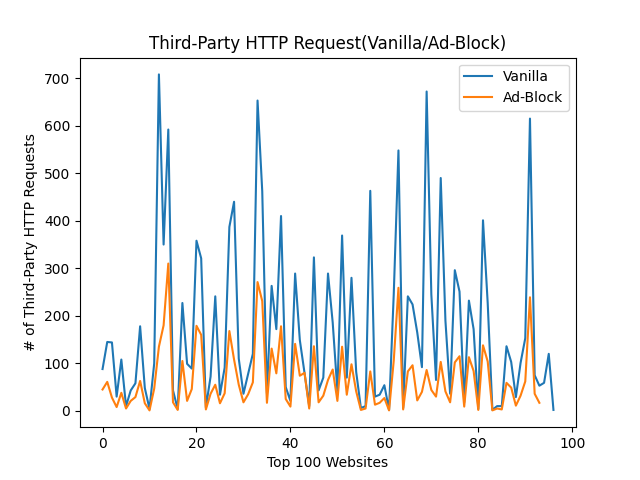

# OpenWPM Analysis 
## Intro
In this project, I conducted different types of browser measurements based on the data collected from 
crawling the top 100 websites. The goal is to analyze the difference in the amount of third-party HTTP requests, 
third-party cookies, and JavaScript API calls when browsing in “ad-block mode” compared to browsing in “vanilla mode” (ad-blocking disabled). 

The top 100 websites are collected from Tranco (https://tranco-list.eu/download_daily/56JN). The open source crawler tool, OpenWPM (https://github.com/citp/OpenWPM), 
is from Mozilla and it records the HTTP requests, cookies, and JavaScript API calls. 

## HTTP Requests

From the plot shown above, we can see that there is a greater amount of third-party requests when browsing in vanilla mode as opposed to ad-block mode. 
On average, the websites in vanilla mode have about 300 HTTP requests, while websites in ad-block mode have an average of about 150 HTTP requests. That is a reduction of about roughly 50% in HTTP requests,
which shows the impact that ad-blocking extensions have on our browsers.

## Top 10 Third-Party Domains (HTTP Requests)
|Domain (Vanilla) | # of HTTP Requests (Vanilla)|   | Domain (Ad-Block) | # of HTTP Requests (Ad-Block) |
| ----------------| ----------------------------|---|-------------------|-------------------------------|
|ssl-images-amazon.com |891                     |   |ssl-images-amazon.com|429                          |
|csdnimg.cn            |512                     |   |csdnimg.cn           |254                          |
|msocdn.com            |498                     |   |msocdn.com           |249                          |
|alicdn.com            |458                     |   | cloudfront.net      |202                          |
|cloudfront.net        |405                     |   | alicdn.com          |198                          |
|pinimg.com            |398                     |   | pinimg.com          |198                          |
|sohu.com              |388                     |   | awsstatic.com       |164                          |
|pstatic.net           |367                     |   |  sinaimg.cn         |152                          |
|awsstatic.com         |329                     |   | qhimg.com           |150                          |
|doubleclick.net       |306                     |   | pstatic.net         |133                          |
